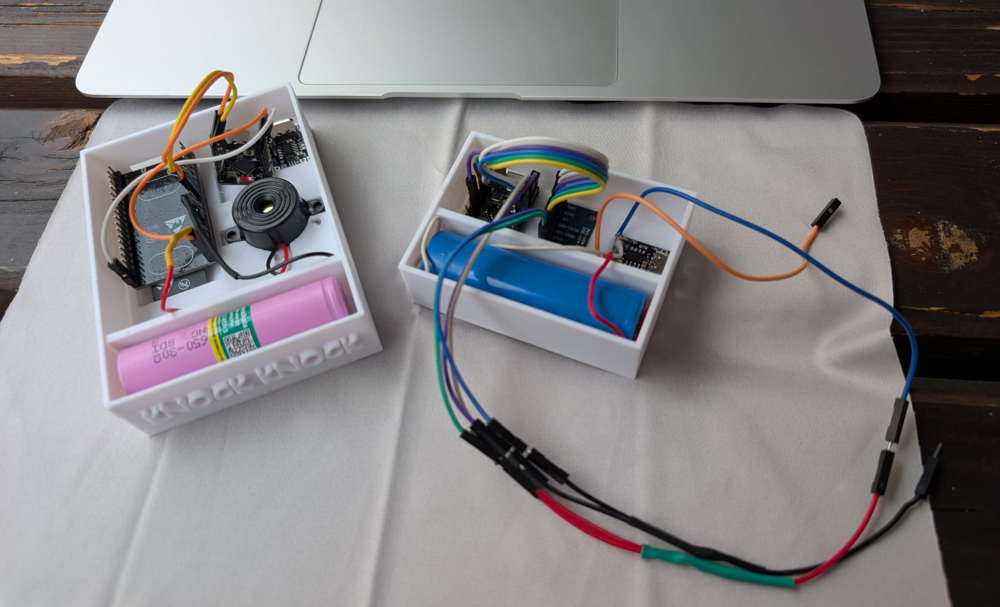
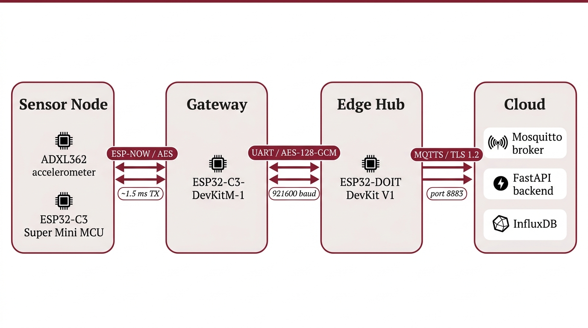

# KnockKnock

## Overview

KnockKnock is a low-cost, wireless, and ultra-low-power IoT intrusion detection system designed for residential and commercial doors and windows. By leveraging modern IoT paradigms, KnockKnock offers seamless, low-impact physical installation, battery-aware behaviors, modular expandability, and robust centralized monitoring via a local Docker-based dashboard.

> **Project Context:** Developed for the course of "Internet of Things" at Sapienza University of Rome, Academic Year 2025/2026.

<p align="center">
  
  
</p>

---

## Key Features

- **Three-Tier Network Isolation:** Designed around a secure, air-gapped topology. The low-power sensor operates in an IP-less subnet communicating via peer-encrypted ESP-NOW. It connects to a local gateway that bridges data via a cryptographically secured serial interface (UART with AES-128-GCM) to the local Hub, preventing direct public internet exposure.
- **Hardware-Level Power Optimization:** Quiescent current is reduced to just 50 µA during deep sleep. A single-core **ESP32-C3 RISC-V SoC** is gated by an ultra-low-power **ADXL362 digital accelerometer watchdog** drawing only 270 nA. The MCU remains completely powered down until woken by a physical motion threshold interrupt, enabling up to 1.6 years of battery life.
- **On-Device K-Means++ Anomaly Detection:** Implements unsupervised anomaly classification directly on the ESP32-C3 microcontroller. Processes a 51-Dimensional Fast Fourier Transform (FFT) mapping the 40 Hz to 100 Hz band to accurately distinguish structural intrusion vibrations (drilling, hammering, glass breaks) from ambient disturbances (wind, traffic, rain) while using only 42 KB of RAM and saving 16x energy compared to transmitting raw data.
- **Silicon-to-Link Cryptographic Security:** Enforces complete defense-in-depth protection:
  - *Silicon Root of Trust:* Burned OTP eFuse registers to permanently disable hardware JTAG debugging and lock down signed firmware via Secure Boot V2.
  - *Data at Rest:* AES-XTS-128/256 flash encryption on application binaries and credentials stored in an encrypted NVS partition.
  - *Link Layer:* ESP-NOW packet frame encryption using AES-CCM with peer-specific Local Master Keys (LMK), isolating physical node compromises.

---

## Our Team

We are a group of Sapienza University of Rome students passionate about IoT, embedded systems, and low-power hardware design.

<table align="center">
  <tr>
    <td align="center" width="33%">
      <br />
      <sub><b>Alessandro Coccia</b></sub><br />
      <a href="https://github.com/ErFonchio" title="GitHub">GitHub</a> • 
      <a href="https://www.linkedin.com/in/alessandro-coccia-2534b72a6" title="LinkedIn">LinkedIn</a><br />
      <sub>Matricola: 1988689</sub>
    </td>
    <td align="center" width="33%">
      <br />
      <sub><b>Leonardo Santucci</b></sub><br />
      <a href="https://github.com/lellosant" title="GitHub">GitHub</a> • 
      <a href="https://www.linkedin.com/in/leonardo-s-654847373" title="LinkedIn">LinkedIn</a><br />
      <sub>Matricola: 2282707</sub>
    </td>
    <td align="center" width="33%">
      <br />
      <sub><b>Antonio Turco</b></sub><br />
      <a href="https://github.com/antonyo-turco" title="GitHub">GitHub</a> • 
      <a href="https://www.linkedin.com/in/antonyoturco/" title="LinkedIn">LinkedIn</a><br />
      <sub>Matricola: 1986183</sub>
    </td>
  </tr>
</table>

---

## Project Timeline and Deliveries

Stay updated with our progress through our project log and presentations.

### Project Blog
> **Project Blog:** Follow our step-by-step engineering journey on the [Knock Knock Blog](https://wiz.altervista.org/iot-course-sapienza/).

### Deliveries

| Stage | Resource / Artifact | Format / Link |
| :--- | :--- | :--- |
| **First Delivery** | First Delivery Presentation | [Presentation](https://github.com/antonyo-turco/iot-presentations/blob/9377e07d5346901678ff115f52adedeaf1f66225/1st-presentation/outputs/main.pdf) |
| **Second Delivery** | Second Delivery Presentation<br>Detailed Design Document<br>Demo Video | [Presentation](https://github.com/antonyo-turco/KnockKnock/blob/main/Second%20delivery%20presentation.pdf)<br>[Report](https://github.com/antonyo-turco/KnockKnock/blob/main/iot-MD/2nd-delivery.MD)<br>[Video Demo](https://youtu.be/wBy7bFRrQwU) |
| **Final Delivery** | Final Presentation Slides<br>End-to-End System Demo | [Presentation](https://github.com/antonyo-turco/iot-presentations/blob/7c1fe8fa58019908c3fef2b911b31b3d940134ad/3rd-presentation/build/main.pdf)<br>[Video Demo](https://youtu.be/919C2gk2Hbs) |

---

## Getting Started

Follow these steps to set up the network, launch the containerized cloud dashboard, and flash the IoT devices.

### Prerequisites

Install the required Python dependencies for the local setup tool:
```bash
pip install -r requirements.txt
```

---

### 1. Network Setup

Run the utility script once before compiling firmware, and again if your local area network (LAN) IP changes:
```bash
python setup_network.py
```

**What this script automates:**
- **Auto-detects** your machine's LAN IP address.
- **Generates** custom TLS certificates for secure MQTT communication.
- **Deploys** the generated `ca.crt` to the firmware cert store (`edge-hub/certs/`).
- **Patches** the target broker IP `CLOUD_MQTT_BROKER_IP` inside `edge-hub/include/config.h`.
- **Generates a QR Code** so you can easily access the web dashboard from your smartphone.

> **Note:** If your LAN IP hasn't changed, the script will automatically exit to avoid resetting certificates. To force certificate regeneration, pass the `--force` flag:
> ```bash
> python setup_network.py --force
> ```

---

### 2. Start the Cloud Infrastructure

Launch the full telemetry stack in background mode:
```bash
docker compose -f cloud-infrastructure/docker-compose.yml up -d
```

Once running, the stack makes the following local interfaces available:

| Service | Port | Endpoint URL |
| :--- | :---: | :--- |
| **Web Dashboard** | `3000` | `http://<LAN-IP>:3000` |
| **Grafana Analytics** | `3001` | `http://<LAN-IP>:3001` |
| **InfluxDB Database** | `8086` | `http://<LAN-IP>:8086` |
| **MQTT Broker (TLS)** | `8883` | `mqtts://<LAN-IP>:8883` |

---

### 3. Build and Flash Firmware

We utilize **PlatformIO** to compile and upload firmware to both components.

#### Edge Hub Gateway
Connect your Edge Hub board and run:
```bash
cd edge-hub
pio run --target upload
```

#### IoT Window/Door Sensor
Connect your low-power window/door sensor board and run:
```bash
cd iot-sensor
pio run --target upload
```
